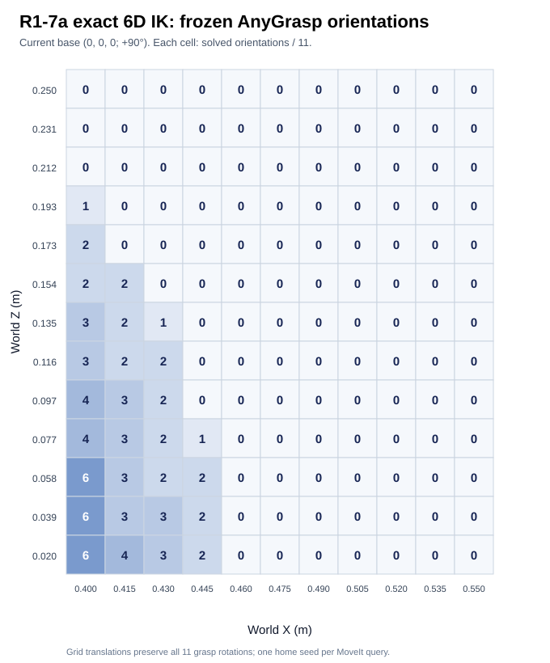

# R1-7a frozen-grasp workspace diagnosis

This report evaluates inverse kinematics only. No AnyGrasp inference,
grasp pose, planning, contact, or robot execution was changed or run.

## Input and methods

The original FR3 benchmark's ten `trial_XX_grasps.json` files are
byte-identical (SHA-256
`50e0a2f758a46edb51f21dee75eae8283cc711f793c2fade7f2c2c9402ea86f3`).
Each file has 11 frozen AnyGrasp candidates. The checked-in
`results/r1a7_workspace/frozen_anygrasp_trial01.json` is one unmodified
copy; each of its 11 candidates has multiplicity ten in the 110-candidate
benchmark. The measured camera-to-world transform, grasp rotation,
translation, and depth are used as published. The frame conversion is the
unchanged R1 conversion from the prior benchmark. No grasp pose is optimized.

`scripts/r1a7_workspace_diagnostics.py` does independent bounded FK/IK
screening and saves residuals, joint positions, and limit margins.
`scripts/verify_r1a7_workspace_moveit.py` asks the same MoveIt service
used by the backend for exact 6D IK, both without and with MoveIt collision
avoidance. The MoveIt collision checks here cover the robot's own geometry;
they do not prove table, mount, scene, or execution clearance. Base placement
is tested by transforming the unchanged world targets into the robot's base
frame, without modifying the URDF or targets.

## Base placement search

109 coarse placements covered base X = −0.20 to +0.30 m, Y = −0.20 to
+0.20 m, Z = 0 to +0.30 m, yaw = 45° to 135°. Another 48 deterministic
local placements refined the leading results. The best was rechecked using
more numerical seeds and MoveIt. Since it solves all 11 unique targets, the
search reached the maximum possible IK count, though it did not optimize
joint-limit margin or physical mount feasibility.

| Base (world x, y, z; yaw) | Independent numerical IK | MoveIt exact 6D IK | MoveIt collision-on IK |
| --- | ---: | ---: | ---: |
| Current `(0, 0, 0; +90°)` | 0/110 | 0/110 | 0/110 |
| Diagnostic check `(+0.20, 0, 0; +90°)` | 70/110 | 70/110 | 60/110 |
| Recommended IK placement `(+0.326, −0.201, +0.147 m; +83.753°)` | 110/110 | **110/110** | **110/110** |

At the original base, bounded position-only FK/IK reaches **110/110**
centers with at most 0.14 µm error. The original 0/110 result is thus
an exact **position plus orientation** reachability problem, not a
position-only distance failure.

At the recommended placement, MoveIt solved every distinct target from
its home seed in one call. The required +0.147 m base height is a raised
mount relative to the original world frame. It is an IK recommendation,
not a verified table-safe mechanical installation.

## TCP and joint-limit ablations

TCP length shifts are along the current Dex1 TCP approach axis. The
`flange` variant places the same unmodified numerical grasp target at
Unitree `Link7` instead of the fingertip TCP. These variants change only
the robot TCP interpretation; the frozen AnyGrasp pose is identical.

| TCP variant | Current base numerical IK | Recommended base numerical IK |
| --- | ---: | ---: |
| Current Dex1 TCP | 0/110 | 110/110 |
| Wrist/flange `Link7` | 0/110 | 0/110 |
| TCP −8 cm | 0/110 | 100/110 |
| TCP −4 cm | 0/110 | 110/110 |
| TCP −2 cm | 0/110 | 110/110 |
| TCP +2 cm | 0/110 | 100/110 |
| TCP +4 cm | 0/110 | 110/110 |
| TCP +8 cm | 0/110 | 80/110 |

MoveIt checks with thirteen seeds and a 0.25 s timeout: at the original
base, current, flange, −4 cm, and +4 cm TCPs each solve 0/110. At the
recommended base, current solves 110/110, flange 0/110, −4 cm 100/110,
and +4 cm 90/110. The bounded
numerical results above are screening estimates; MoveIt's exact-pose
search is authoritative for the reported recommended placement. The
borderline difference between solvers for small length shifts is a
reason to retain the physically derived current TCP.

At the original base, the nearest-limit joint in the best numerical
near-miss was J6 for 5/11 unique candidates, J5 for 2/11, and one each
for J1/J2/J3/J7. A failed pose has no true IK solution, so this is a
diagnostic of the optimizer's nearest reachable posture, not a proof of
which limit caused failure. Hypothetically expanding the *numerical*
J6 limit by another ±30° and ±60° still solved 0/110 at the original base.
The official URDF limit and MoveIt configuration were not changed.

At the recommended base, the MoveIt successful solutions have J6 median
margin 0.051 rad (~2.9°), with some solutions on a limit. This is a
robustness concern for later motion work, even though J6 alone does not
explain the original 110/110 `NO_IK`.

## X–Z heatmap at the original base

The heatmap centers rank 0's TCP at each X/Z cell and translates the
other ten frozen target positions by the same amount. All eleven real
AnyGrasp orientations stay unchanged. X spans 0.40–0.55 m, Z spans
0.02–0.25 m. Each cell reports the number of unique orientations with
exact 6D IK, out of 11. The final heatmap is produced by MoveIt with
one home seed and a 0.06 s IK timeout per candidate; this is a conservative
lower bound where a failed first seed might be rescued by more seeds.

| Z / X (m) | 0.400 | 0.415 | 0.430 | 0.445 | 0.460 | 0.475 | 0.490 | 0.505 | 0.520 | 0.535 | 0.550 |
| --- | ---: | ---: | ---: | ---: | ---: | ---: | ---: | ---: | ---: | ---: | ---: |
| 0.020 | 6 | 4 | 3 | 2 | 0 | 0 | 0 | 0 | 0 | 0 | 0 |
| 0.039 | 6 | 3 | 3 | 2 | 0 | 0 | 0 | 0 | 0 | 0 | 0 |
| 0.058 | 6 | 3 | 2 | 2 | 0 | 0 | 0 | 0 | 0 | 0 | 0 |
| 0.077 | 4 | 3 | 2 | 1 | 0 | 0 | 0 | 0 | 0 | 0 | 0 |
| 0.097 | 4 | 3 | 2 | 0 | 0 | 0 | 0 | 0 | 0 | 0 | 0 |
| 0.116 | 3 | 2 | 2 | 0 | 0 | 0 | 0 | 0 | 0 | 0 | 0 |
| 0.135 | 3 | 2 | 1 | 0 | 0 | 0 | 0 | 0 | 0 | 0 | 0 |
| 0.154 | 2 | 2 | 0 | 0 | 0 | 0 | 0 | 0 | 0 | 0 | 0 |
| 0.173 | 2 | 0 | 0 | 0 | 0 | 0 | 0 | 0 | 0 | 0 | 0 |
| 0.193 | 1 | 0 | 0 | 0 | 0 | 0 | 0 | 0 | 0 | 0 | 0 |
| 0.212 | 0 | 0 | 0 | 0 | 0 | 0 | 0 | 0 | 0 | 0 | 0 |
| 0.231 | 0 | 0 | 0 | 0 | 0 | 0 | 0 | 0 | 0 | 0 | 0 |
| 0.250 | 0 | 0 | 0 | 0 | 0 | 0 | 0 | 0 | 0 | 0 | 0 |

For these frozen orientations, every grid point at X ≥ 0.460 m failed
from the original base, at every scanned height. Low Z alone is not the
explanation: at X = 0.400 m and Z = 0.020 m, 6/11 orientations solved,
while at X = 0.400 m and Z = 0.250 m, 0/11 solved. The real benchmark
centers lie at X = 0.481–0.520 m and Z = 0.030–0.040 m.

## Conclusion

The original base placement is the dominant cause of the frozen-grasp
IK failures: moving the base into the task region rescues every original
pose without touching AnyGrasp or the Dex1 TCP. The current grasp targets
are around world X = 0.481–0.520 m and Z = 0.030–0.040 m, a difficult
far/low combination for the original mounting frame. Position-only IK
was previously 11/11 at those centers, so the combination with the
required grasp orientations is decisive. The J6 limit is a secondary
margin issue. The current Dex1 TCP is not the root cause, since length
changes do not rescue any pose at the original base and it solves all
poses at the recommended base. A flange TCP would make this frozen grasp
set worse under the tested interpretation.
