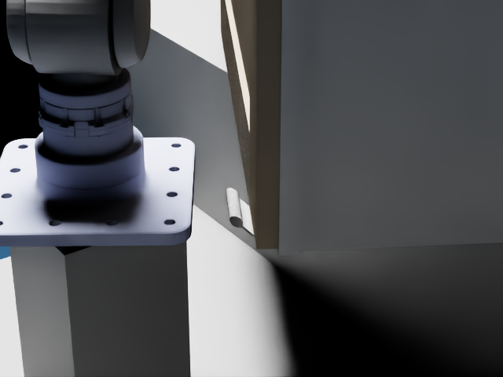

# R1/Dex1 PhysX-Mobility 47686 cabinet demo

This is a standalone articulated-object experiment. It does not change the
existing rigid-grasp benchmarks or control real hardware. The configured task
is `抓住把手打开柜门`, resolved before execution to `cabinet door handle` and
`open`.

## Sources and frames

- Asset: prepared PhysX-Mobility **47686** URDF and USD under
  `/data1/home/rangeryx/datasets/physx_mobility/prepared/47686_v1`. Its one
  revolute joint is `joint_revolute_l_2_abstract_2_1`, with source limits
  `0..2.094395 rad`. The prepared source handle mesh is `original-29`.
- Robot: the repository's Unitree R1-7a plus official Dex1-1 URDF collision
  mesh, prepared by `scripts/prepare_r1a7_description.py`. The provisional
  Link7 to Dex1 adapter and TCP calibration are documented separately in
  `config/end_effector_calibration.yaml`.
- World poses are `T_B_X`; camera `C` is optical (+x right, +y down, +z
  forward). GraspGen-X produces camera-frame grasps. The shared
  `grasp_compare` adapter produces `T_B_TCP`. MoveIt and Isaac FK for the TCP
  are checked against each other before planning. `URDFChain` uses the asset
  URDF joint origin, axis and limits to generate opening waypoints while
  retaining the measured moving-link to TCP grasp transform.

## Run

On the Isaac host, use the ROS/MoveIt environment that already launches the
R1 backend. The official SAM3 repository and its authorized checkpoint must
be available; the runner never uses a simulator mask as a substitute.

```bash
cd /data1/home/rangeryx/fr3_real2sim_r1a7
export SAM3_ROOT=/data1/home/rangeryx/sam3_official
export SAM3_DEPENDENCY_OVERLAY=/data1/home/rangeryx/sam3_overlay
python scripts/run_articulated_47686.py \
  --stage full \
  --sam3-checkpoint /path/to/authorized/sam3.pt \
  --cutoff-local 2026-09-30T05:00:00+08:00 \
  --output results/articulated_47686_demo
```

Use `--stage smoke` for Isaac RGB-D/asset loading, or `--stage motion-smoke`
for that plus MoveIt scene and FK checks. The cabinet installation is
parameterized by `--asset-x`, `--asset-y`, `--asset-yaw-deg` and
`--fixture-height-m`; `--camera-offset DX DY DZ` is relative to the source
handle center. The first trial defaults to `(0.45, 0.05, -90°)` and a
recorded 0.18 m fixture. These are simulation installation parameters, not
modifications to the source asset. Freeze a single chosen installation before
the full grasp trial.

The full run saves captured RGB-D and calibration, the SAM3 mask and overlay,
raw GraspGen-X candidates, Dex1 collision checks, local variants, planning
and execution records, contact forces, joint-angle history and an RGB video.
Success requires actual Isaac joint motion of at least 20°, two seconds of
hold and no measured slip. The simulator sets the cabinet joint only during
reset. Its opening motion must be caused by the planned R1 arm trajectory.

## Diagnostic status

The first fixed-pose Isaac capture and the MoveIt FK smoke test passed.
Asset URDF moving-link FK and Isaac agreed within `9e-8 m` and `1.3e-8 rad`
at a measured nonzero door angle. The official SAM3 code imports, but the
available Hugging Face account received HTTP 403 for the gated checkpoint.
No SAM3 mask, grasp execution or physical opening has been claimed.

An **evaluator-only** geometry diagnostic used an Isaac instance mask to
investigate reachability; it is excluded from the full runner's grasp input.
It found 100 GraspGen-X proposals and 13 raw Dex1 scene collision-free
proposals at the initial placement. None passed MoveIt IK. A bounded
125-pose cabinet grid had zero exact kinematic solutions for 108 placements
and one for 17 placements among those 13 raw proposals; this grid is only a
screen and does not establish a collision-free opening path. A measured Dex1
open-finger servo drift of about 2.6 micrometres below its URDF limit was
also found to mislabel otherwise valid arm IK as `NO_IK`. The standalone
articulated backend clamps only this tiny feedback drift. A candidate with
offline exact IK at `(0.20, 0.20, -120°)` failed MoveIt collision checking
against the robot base, pedestal and cabinet, and the camera saw only 231
handle pixels there versus 1803 at the original placement. These are
diagnostics of an infeasible installation, not successful trial results.

Expanding the local Dex1 search to 3900 variants left 406 scene collision-free
variants at the initial placement, but **0/406** had offline exact IK. In a
focused 27-pose subgrid, the best pose had two offline IK variants. Both were
rejected by MoveIt due to cabinet and robot self collision, while the tested
camera saw zero handle pixels at that pose. The alternative side camera at
`(0.20, 0.20, -120°)` restored 1257 visible handle pixels and passed the
MoveIt/Isaac FK smoke test, but its grasp candidate also collided with the
base and pedestal. The full runner exits before starting Isaac if the SAM3
checkpoint is absent. These measurements are preserved in
[`articulated_47686_preflight_summary.json`](articulated_47686_preflight_summary.json).


