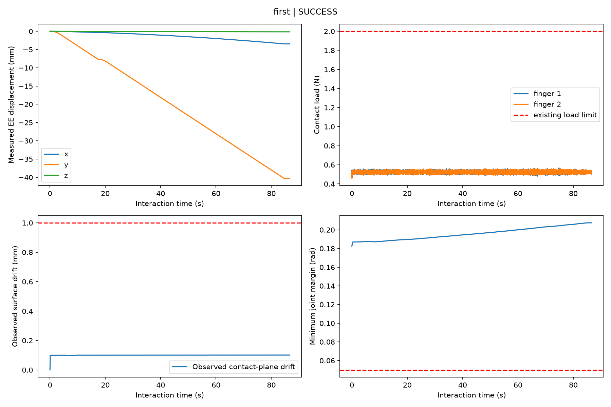

# PiPER：真实接触下的 Act2See-style 未知关节闭环

日期：2026-10-03。分支：`codex/piper-mobile-door`。物体：既有 prepared PhysX-Mobility **7320**。没有更换资产、抓取姿态或底盘。

## 实测结论

**首次成功 + 三次重复，4/4 完成：真实抓持 → 未知关节探测 → EE-only 估计 → 估计模型引导继续开门 → 停留 2 秒。** 实际门角均为 **5.614865°**。同初始状态的 zero-probe 对照只变化 **0.004577°**，返回 `UNOBSERVABLE`。

这是单一冻结场景的确定性重复：四次 `ee_probe_trajectory.json` SHA256 完全相同（`8524cbee84f0c87c05689a92d5bb450e8c0ec736f9c7616b70b7b268e130d0bb`）。不能将其解释为跨场景泛化率或真机可靠性证明。完整滑移的在线可观测性也仍有限，见下面的安全说明。

| 运行 | 实际最终门角 | 探测 EE 位移 | articulation | 事后最终真实平移滑移 | 全程最小关节余量 | 结果 |
|---|---:|---:|---|---:|---:|---|
| first | 5.614865° | 7.670914 mm | revolute | 0.145076 mm | 0.063490 rad | SUCCESS |
| repeat_01 | 5.614865° | 7.670914 mm | revolute | 0.145076 mm | 0.063490 rad | SUCCESS |
| repeat_02 | 5.614865° | 7.670914 mm | revolute | 0.145076 mm | 0.063490 rad | SUCCESS |
| repeat_03 | 5.614865° | 7.670914 mm | revolute | 0.145076 mm | 0.063490 rad | SUCCESS |
| zero_probe | 0.004577° | 0.180425 mm，无主动 drive | UNOBSERVABLE | 0.174861 mm | 0.063490 rad | 符合对照预期 |

视频：[完整连续视频：接近、闭合、探测、开门、保持](first/full_interaction.mp4)；[从闭合末段开始的短版](first/probe_and_opening.mp4)。短版只裁去开头接近段，没有改变播放速度或拼接成功片段。



## A. Grasp

复用 `f5dcc6f` 的 nominal grasp、approach、慢速闭合和初始 hold。建立并维持 bilateral load；没有 attachment/weld、向门施加外力或执行期门关节状态命令。夹持预载、摩擦、官方未分割夹爪、interaction proxy 和碰撞验收均未修改。

- 主动交互期间两指载荷约 0.5 N/指，最大单指 **0.566144 N**；包含闭合阶段全程峰值 **0.596624 N/指**。交互期间两指合力峰值 **1.080609 N**。
- 停止后首次读取 object pose，最终真实相对平移漂移 **0.145076 mm**，旋转漂移 **0.271844°**。这是 gripper 与 moving link 的相对变换，不把正常开门位移当滑移。
- **最大真实相对滑移没有在线直接测量，报告中保持 `null`。** 在线 contact-plane 法向漂移/倾斜峰值 **0.101106 mm**；这不是完整滑移。
- 事后用记录的 contact normal + 允许读取的 GT axis/origin 重建，估计过程平移滑移峰值 **0.377671 mm**，重建最终值 0.144261 mm。重建门角与最终 GT 相差 0.001841°。其假设是受载接触法向跟随同一目标支撑面；它是诊断估计，不是直接记录的 GT trajectory 或严格误差上界。

## B. Probe / attempt history

首个方向来自初始实测 gripper frame 的 outward 方向，世界坐标为：

```text
[-0.04162896, -0.99912295, +0.00451307]
```

仅使用这一方向即获得有效估计，因此未启动其它三种备选方向。单次探测 **17.004167 s**，有用实测 EE 位移 **7.670914 mm**，EE 旋转跨度约 **1.000002°**。从达到 5 mm 后开始拟合，直到旋转激励、残差和模型评分均满足质量门槛才进入执行。

备选策略已经实现：outward、outward ±0.25 lateral、lateral，全部来自初始观测 frame；每次探测记录方向、位移、退出原因。12 秒仍不足 2 mm 时回到稳定非驱动 hold 再换方向；最多四次，单次 35 秒，累计探测位移预算 20 mm。没有扩大 grasp search。

控制为 0.5 mm/s、2 秒缓升的方向阻抗，任务力上限 0.20 N、力矩上限 0.01 N·m。仅 probe 方向有位置刚度，正交平移和旋转刚度为零、保留阻尼，门约束可以带动 EE 偏离初始方向。没有刚性 6D 目标或 GT 圆弧。

## C. Identification

输入仅为 **measured EE SE(3)**，不使用 object joint、moving-link pose、PnP 或 RGB-D depth-consistency 判断。

最终在线保存的模型（世界坐标，axis 正负等价）：

```text
joint type    revolute
axis          [-0.012812758, -0.000354958, -0.999917850]
point on axis [ 0.235309145, -0.179692573,  0.167418200] m
radius        0.423496940 m
position RMSE 0.214195 mm
rotation RMSE 0.0000837001 rad (0.004796°)
confidence    0.999，模型 score gap，不是校准后的成功概率
```

事后 GT 评估：

- joint type：正确。
- axis angular error：**0.734419°**。
- axis-line distance error：**10.830343 mm**。
- 观测轨道平面内 origin error：12.109410 mm。轴上点有不可辨识的沿轴自由度，不能把原始两点距离 172.9 mm 当作轴线误差。
- GT 约束重建轨迹 RMSE：0.616735 mm。

短圆弧仍导致厘米级轴线误差；低拟合残差不等价于高精度 joint origin 标定。

## D. Estimated-model execution

首次可靠估计后，保存 `estimated_articulation.json`、`structured_memory.json` 和 `estimated_articulation.urdf`。后续切向只从当前 EE 和该估计模型计算，每实测前进约 1 mm 更新一次局部方向，每 2 秒加入新 EE 数据重新拟合。

本次共 **34 次接受的估计（初次 + 33 次更新）**。在线停止条件为估计转角 5.5°，然后保持 2 秒；停止并保存估计后才读取 GT，得到真实 **5.614865°**。GT door angle 从未用于在线选择方向、切换阶段或停止。

全部交互实测 EE 位移约 **40.432340 mm**。环境 articulation 约束产生运动，机器人通过接触传力并顺应跟随。

Zero-probe 使用同一抓取和同一顺应控制，只关闭任务 drive；与主动运行等长（总计 171.8625 秒）。它不具备 5 mm 有效激励，正确返回 `UNOBSERVABLE`。原始对照报告中的 `probe.failure_phase=ZERO_PROBE` 是通用汇总字段，不表示对照异常。

## E. Safety 与边界

- 全过程最小 joint margin **0.063490 rad**；探测/跟随期间最小 **0.182645 rad**，均高于未修改的 0.05 rad。
- 保留机器人自碰撞、环境危险接触、既有载荷/力矩/速度、持续接触丢失停机。没有 raw-triangle 零交叠或 ownership 微米 gate。
- 四次成功运行无危险接触停机、持续 grasp loss 或关节越界。zero-probe 保持抓持。
- **在线完整滑移保护尚未被充分验证。** 禁止 GT moving-link trajectory 且不使用视觉追踪时，平行接触面内滑移不能由 q/EE/标量接触力唯一恢复。当前使用 native contact manifold 模拟触觉/邻近观测，监测接触面法向漂移和倾斜；有模型后再检查 EE 与估计 screw motion 的一致性。沿接触面的某些滑移仍可能不可观测。
- 这两项检测沿用 1 mm / 0.1 s 停机门槛；三次复验模型一致性峰值 **0.385148 mm**。没有将接触偏移或 raw/cooked 差异改成新的穿透许可。
- 首次成功的 v7 还没有新增模型一致性停机；其离线重放峰值为 **0.383888 mm**，低于同一门槛。三次复验使用最终带该附加检查的代码，EE 轨迹与首次逐字节相同。最终版本未修改 grasp/contact baseline。
- 真机若只有双侧标量力，需要补充可观测的滑移信号；当前结果证明该仿真闭环可行，不代表真机安全性已验证。

## 实现、冻结验证和复现

- [独立入口](../../../scripts/run_piper_act2see_loop.py)：原 grasp 段、GT access guard、阶段循环、日志和试验调度。
- [控制与 memory](../../../interaction_identification/act2see_loop.py)：方向顺应控制、最多四次 attempts、现有 `fit_articulation()`、estimated URDF、切向更新。
- [回归检查](../../../scripts/test_act2see_loop.py)：55 µm 不可辨识、合成 EE-only screw fit、无正交姿态弹簧、力上限、tangent 更新保留缓升、压力重分布不冒充滑移，以及显式不可观测分量。
- [运行说明](../../act2see_contact_loop.md) 含参数和方法来源。

服务器单一运行命令（先进入现有服务器仓库目录）：

```bash
cd /data1/home/rangeryx/fr3_real2sim_piper_mobile && env -u PYTHONPATH -u CUDA_VISIBLE_DEVICES /data1/home/rangeryx/isaaclab-arena/.venv/bin/python scripts/run_piper_act2see_loop.py --source /data1/home/rangeryx/fr3_real2sim_r1a7/results/microwave_7320_table_edge_preflight_full_rgb --asset-root results/semantic_interaction/asset --plan results/semantic_interaction/nominal_minimal/plan.json --output results/act2see_contact_loop_reproduce --gpu 1 --repeat 3
```

默认截止时间为下一次上海时间 05:00；首次成功后做三次重复和等长 zero-probe。现有资产、Isaac 环境与冻结输入依赖服务器准备文件，Git 仓库并未包含所有原始 USD/相机数据。

每次运行对六个 baseline 源文件及 interaction proxy manifest 校验 SHA256；详见 `first/frozen_baseline.json`、`first/frozen_proxy.json`。源代码与已有 baseline 完全一致。固定底盘 `(0.5, -0.55, -0.1 m; yaw=150°)` 未变。

## 调试记录：没有将失败尝试计入 4/4

早期独立入口的工程调试保留在服务器 `results/act2see_loop_v1` 至 `v7`：

| 版本 | 首个问题 | 本轮修正 |
|---|---|---|
| v1 | NumPy bool 无法 JSON 序列化，未形成有效运行 | 日志转 Python bool |
| v2 | 原生 Jacobian 参考点误认为 link origin | 使用真实 COM→TCP 位移，float64 FK 核验；最终误差约 2e-6 |
| v3 | 原生 qdot 与步间实际位移不一致导致伪 overspeed | 由连续 q/EE 观测求差分，原生速度仍保留日志 |
| v4 | 接触压力在角点间切换造成虚假的 22 mm “滑移” | 使用接触面法向漂移/倾斜，明确不能观测完整滑移 |
| v5 | 换控制器后的弹性姿态过渡污染拟合，最后 UNOBSERVABLE | 单独记录 0.5 秒非驱动 settle，再开始拟合；增加总探测 20 mm 预算 |
| v6 | 每 1 mm 更新切向时重置缓升，导致 4.46° 超时 | 保留速度缓升与有界顺应 lead，仅更新方向 |
| v7 | 完整闭环成功 | 首次成功与后续三次重复构成本报告 4/4 |

v5 曾实际运动约 10°，但未建立可靠估计，也没有完成 estimated-model 跟随，**不算本任务成功**。不把调试过程隐藏成从未失败。

## 数据位置

Git 中保存每次 report、GT-only evaluation、估计模型、memory、30 Hz sensor trace、图表，首轮完整视频和短版视频。

服务器全量 240 Hz EE/q/contact/command 数据、逐物理步日志和每轮视频：

```text
/data1/home/rangeryx/fr3_real2sim_piper_mobile/results/act2see_contact_final_20261003/
  first/ repeat_01/ repeat_02/ repeat_03/ zero_probe/
```

`process_ids.json` 记录后三次重复与对照的实际命令、进程和退出码；first 来自已完成的 v7，原数据保留。`first_code_snapshot.tar.gz` / `repeat_code_snapshot.tar.gz` 保留对应版本。

方法参考：[Act2See 官方项目页](https://lauyihong.github.io/act2see/)、[官方链接仓库](https://github.com/lauyihong/Act2See)。公开仓库当时为项目网页，未提供可直接运行的底层机器人控制器；本实现是 **Act2See-style interaction loop**，不是完整论文代码复现，也未实现 VLM planner。
