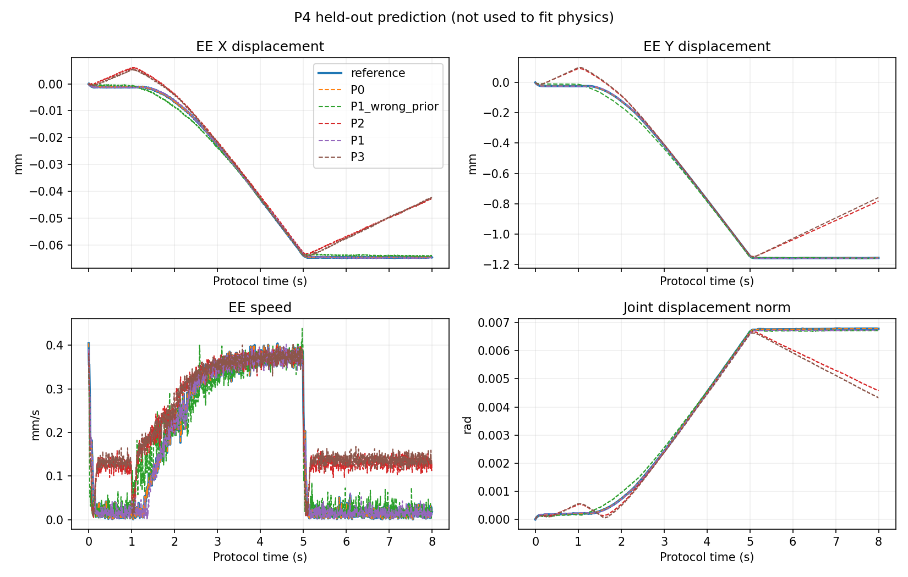
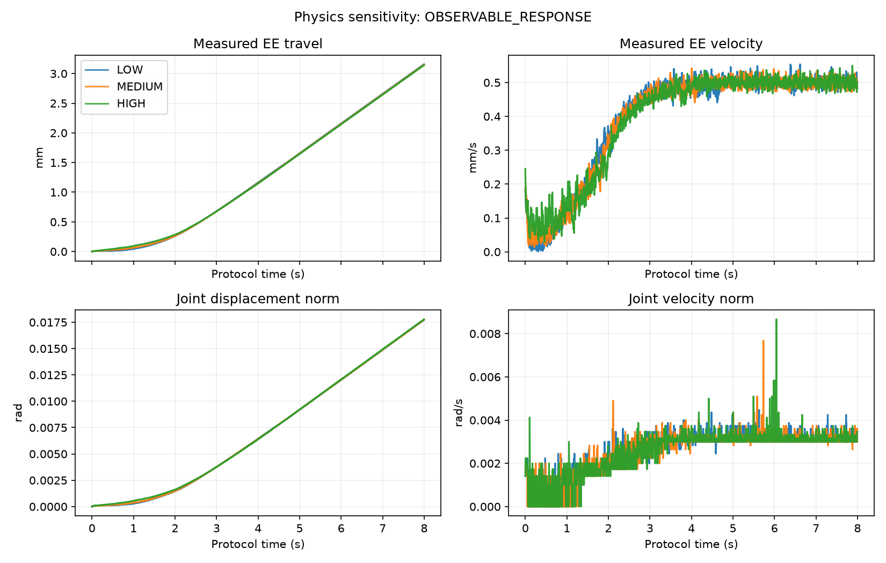

# Mobile recovery / physics decomposition 实测记录

实验：`results/interactive_twin_recovery_20261003_v2`。模式为
**SIM_TO_SIM_BLIND_SYSID**。这份记录不代表真机实验。

## 冻结 12 场景：mobile 部分已完成

| 指标 | Fixed base | 含 mobile recovery |
|---|---:|---:|
| IK / approach / 路径可行 | 1/12 | 6/12 |
| 真实 bilateral grasp | 1/12 | 4/12 |
| articulation identification | 1/12 | 3/12 |
| 实际开门增量 ≥5° | 1/12 | 3/12 |

新增恢复了 5 个规划可行场景、2 个真实开门成功场景。
全部成功仍集中于 **45621 的三个配置，涉及 1/4 个资产**。
不能将配置覆盖率改善写成已证明跨物体稳定操作。

| 成功配置 | 实际开门增量 | min joint margin | axis angular error | axis-line distance | final relative slip |
|---|---:|---:|---:|---:|---:|
| 45621_00 fixed | 5.585° | 0.052935 rad | 1.467° | 15.312 mm | 0.501 mm |
| 45621_01 mobile | 5.518° | 0.576946 rad | 1.896° | 1.027 mm | 0.185 mm |
| 45621_02 mobile | 5.488° | 0.496481 rad | 1.387° | 1.955 mm | 0.206 mm |

角度为相对初始状态的增量。slip 是事后最终相对变换，不是全程最大值。
axis-line distance 不把轴向不可辨识的 origin gauge 当成误差。

### 未恢复场景

- **45130，3/3**：目标 TCP 高度距固定 base 至少 0.985708 m，
  URDF 链长度三角不等式给出的保守最大 reach 为 0.893242 m。
  SE(2) 搜索不能改变高度，因此无法补救。没有升高底座。
- **45166，3/3**：存在部分 exact IK，但冻结 grasp family 仍有手指与门板/把手
  的几何冲突，部分 base 的 home 也不可用。没有放宽碰撞规则。
- **7138_00**：静态路径恢复，但真实双侧抓持未建立。实际门在抓取前已偏转约 81°；
  route 的机器人 loaded contact 为零。未做该初态的无操作对照，不能仅凭这一点
  断言唯一原因是重力，更不能把自行开门算操作成功。
- **7138_01**：实际 bilateral grasp 已建立，在 `COMPLIANT_SETTLE`
  触发 `PROBE_CARTESIAN_SPEED_LIMIT`，未进入可靠辨识。没有修改控制增益或速度上限。
- **7138_02**：首先发生 `BILATERAL_HOLD_NOT_ESTABLISHED`，之后消耗完配置预算。
  汇总保留首个物理失败与最终预算终止，避免用 timeout 掩盖抓持失败。

### 基础设施修复与重试

移动 callback 生命周期、等价 FCL shape 缓存和 NaN 汇总问题仅在新入口修复。
7138_00 做过一次原姿态、原控制、原参数的基础设施重验证；旧运行和额外运行
均保留 provenance。没有把重启当成新的搜索预算。

底盘是 collision-checked **kinematic SE(2) reposition → stop → manipulate**，
尚未验证轮式动力学或真实导航。抓持/辨识/滑移失败不会触发再次移动。

## Physics decomposition

P1 的 9 点冻结参数网格全部完成实际 Isaac 运行。训练选中 `tau_c=0, b=0`，
held-out P4 没有参与参数选择。P1 gate 已通过：

| GT kinematics 下的 physics | Held-out EE RMSE | 启动时间误差 | EE velocity RMSE | final displacement error |
|---|---:|---:|---:|---:|
| 冻结错误 prior `(0.012, 1.0)` | 0.138123 mm | 0.208333 s | 0.027597 mm/s | 0.011426 mm |
| 训练选出的 `(0, 0)` | 0.008858 mm | 0.029167 s | 0.018019 mm/s | 0.002572 mm |

EE RMSE 减少约 93.6%。这支持 motion-only input-response calibration
在当前 GT-kinematics 仿真对照中改善新动作预测。它不证明真实铰链阻力为零：
这是 9 点粗网格的最优点，训练 RMS 残差仍为声明噪声尺度的 7.37 倍；
单点 profile support 也不是统计置信区间。

P0 / P2 原生 held-out 已完成：

| 组 | Held-out EE RMSE | 启动时间误差 | final displacement error |
|---|---:|---:|---:|
| P0 GT kin + GT physics | 0 mm | 0 s | 0 mm |
| P2 estimated kin + GT physics | 0.119572 mm | 0.937500 s | 0.375433 mm |

仅 kinematic estimate 的误差就使预测恶化至 P1 的约 13.5 倍。
P2 的结构来自同一份 EE-only estimate：axis error 0.758556°，axis-line distance
11.028184 mm。在这个对照中，kinematic error 已是主要问题。
P3 原生 held-out 也已完成：EE RMSE **0.119981 mm**，启动时间误差
**0.962500 s**，final displacement error **0.399204 mm**。
P3 与 P2 的 EE RMSE 仅相差 0.000409 mm，低于声明的 0.020 mm position noise scale；
两者在这里基本相同，均远差于 P1。P3 对 T1 没有预测改善。

**结论：kinematic estimation error dominates physics prediction。**
P1 与 P3 都选中同一粗网格点 `(0,0)`，不能据此声称已证明参数在补偿结构误差。
可以确定的是，physics fitting 没有消除这部分结构误差。
按停止规则，不扩展 45621 physics calibration，也不调 friction optimizer。
独立 imperfect visual prior 已实际运行，在 `FORCE_HOLD` 阶段发生
`REPLAY_BILATERAL_HOLD_NOT_ESTABLISHED`：第一次失败状态两侧接触约
0 / 1.057 N，实际 aperture 24.336 mm；期间物体已偏转约 0.685°。
它未进入 P4，因此 **没有完整的 T_prior vs updated held-out RMSE 比较**。
保留失败，不删去它、不替换 prior、不通过状态 replay 或 attachment 强行建立抓持。
这一对照尚不能支持“更新 twin 改善了 imperfect visual prior 的完整 held-out 预测”结论。

事后解析诊断：保持当前仿真 geometry-mass approximation，GT 竖直轴初始
gravity bias 为零；EE 估计轴对应约 -0.003707 N·m 的 gravity bias。
该值是假设重力 9.81 m/s² 的模型解析量，不是测得的外部力矩，且不进入 controller/fitter。
它为轴误差污染阻力预测提供机制解释；实测影响以 P2/P3 对照为准。
同一 P4 停止驱动后的 5.2–7.8 s 窗口，P0/P1 净位移仅 0.00952/0.00869 mm，
P2/P3 仍漂移 0.33206/0.35350 mm。已核对这一窗口的 `drive_active` 全为 false。
该事后响应与估计轴引入 gravity bias 的解析诊断一致，但不用于重新拟合本轮参数。

并发 visual import cache 初始化曾导致一个任务在开始物理测试前失败。
该失败已归档，缓存改为串行预热后用完全相同参数重试。
它不计作阻力不可辨识或真实接触失败。

LOW/MED/HIGH sensitivity 与 robot-only calibration 使用已有冻结数据，
带 import provenance，不称为本轮新执行。当前没有经过独立标定的 current/effort，
不报告 B3 或真实铰链 torque。

## 复现与证据

统一命令与阶段说明见 [运行文档](interactive_twin_recovery.md)。
[Mobile 实测表](benchmark_evidence/interactive_twin_recovery_20261004/cross_object_mobile.csv)
包含初始/选择后的 base pose、行程、每阶段成败；
[Physics 分解表](benchmark_evidence/interactive_twin_recovery_20261004/physics_decomposition.csv)
包含训练/held-out、启动延迟、速度和最终位移误差。
[冻结 manifest](benchmark_evidence/interactive_twin_recovery_20261004/frozen_manifest.json)
和 [停止决策](benchmark_evidence/interactive_twin_recovery_20261004/research_decision.json) 保留在仓库。
每个 episode 保存原生 report、视频和失败日志。
`scripts/summarize_interactive_twin_recovery.py` 从实际结果生成两张主表。

`f5dcc6f` / `cd61660` 成功 baseline 的抓取、接触、碰撞、proxy、friction、
force limit 和 joint margin >0.05 rad 保持冻结。
当前安全 supervisor 仍使用 PhysX 信号，未证明无 F/T 或 tactile 时完整在线 slip observability。
