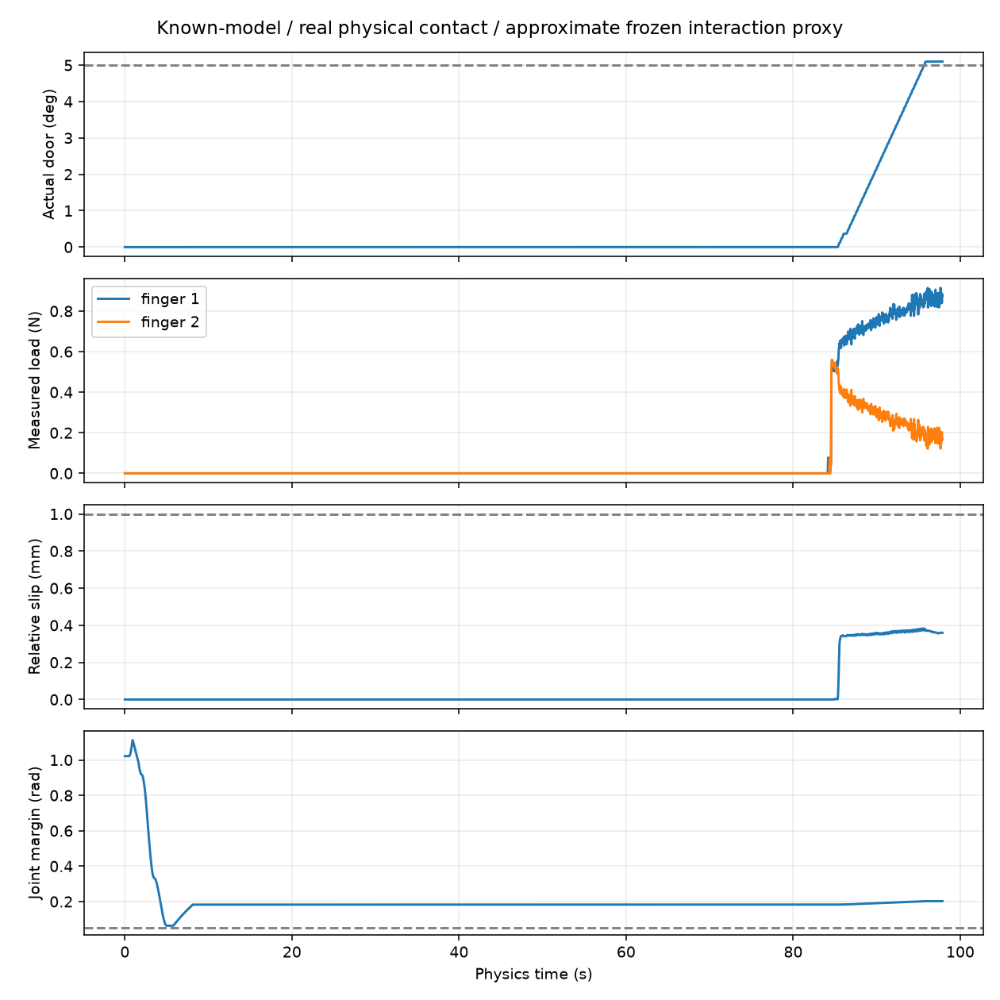

# PiPER known-model physical-contact baseline

This is an independent task entry. Previous ownership and raw-mesh experiments
remain available; the entry does not call their acceptance gates.

## Run on the simulation server

```bash
cd /data1/home/rangeryx/fr3_real2sim_piper_mobile
env -u PYTHONPATH -u CUDA_VISIBLE_DEVICES \
  /data1/home/rangeryx/isaaclab-arena/.venv/bin/python \
  scripts/run_piper_contact_baseline.py \
  --source /data1/home/rangeryx/fr3_real2sim_r1a7/results/microwave_7320_table_edge_preflight_full_rgb \
  --asset-root results/semantic_interaction/asset \
  --plan results/semantic_interaction/nominal_minimal/plan.json \
  --output results/physical_contact_baseline_v4 \
  --gpu 6 --max-candidates 12 --repeat 3 \
  --deadline-shanghai 2026-10-03T05:00:00+08:00
```

The deadline is explicit: later reproduction must supply a future deadline.
Use a fresh output directory to preserve earlier trials.

## Frozen model and acceptance

- Official unsplit PiPER finger collisions: exactly one native collider per
  finger. No pad/metal partition is installed.
- Dataset 7320 visuals and the existing bar plus two-support interaction proxy
  are retained. The proxy is approximate interaction geometry, not a measured
  real-hardware reconstruction. Its manifest and URDF hashes are recorded.
- The fixed base, source installation, object physics, friction, finger effort
  cap, robot drive parameters, and IK settings are inherited unchanged.
- Known asset joint geometry supplies only robot reference poses. The door is
  passive, with no attachments, execution resets, or direct external forces.
- Native contact against explicit handle primitives is permitted on distal
  inner finger surfaces and holding edges. Root/back/palm contact and contact
  against the door panel, fixture, table, or robot remain forbidden.
- Cooked scene geometry checks self/scene collision; joint margin must remain
  above 0.05 rad. Raw triangle intersection and ownership coverage are not
  execution gates. Contact offset is not a penetration tolerance.
- Slow cumulative closure pauses squeezing on unilateral contact, uses bounded
  geometric centering, and transitions to the existing 0.5 N preload controller.
  The existing 2 N low-preload load limit and 10 N actuator cap remain.
- Bilateral acceptance uses a 0.5 s observation window, an enclosed handle,
  stable aperture, and contact duty. It does not require equal instantaneous
  finger forces. Sustained contact loss and relative slip remain stop conditions.
- Slip is measured from `inverse(T_moving_link) @ T_TCP`, not world TCP motion.
  The existing 1 mm sustained-slip stop remains; no new penetration threshold
  is introduced.

## Outputs

`summary.json` records actual physical trial outcomes. Each trial contains a
continuous `contact_baseline.mp4`, `observations.json`, `physics_steps.json`,
native cooked exports, frozen proxy fingerprint, and a report with the first
failure state. `arc.json` records the short known-model reference preflight.

At most twelve local variants of the existing bar-side-pinch family are tried.
After the first success the same candidate is repeated three times, followed by
a no-operation control lasting at least as long as the successful episode.
Software failures stop candidate
enumeration; they are not labelled physical grasp failures.

Success requires measured door motion of at least 5 degrees, a two-second final
hold, retained bilateral grasp, and all safety checks. The 2 mm milestone uses
actual measured TCP displacement and separately reports actual door motion.
Planning or a command displacement is never counted as physical success.

## Actual results, 2026-10-03

The nominal candidate succeeded without a pose search. The final, frozen code
completed the first run and three repetitions, each from a fresh identical
initial state. The no-operation control then completed without door motion.

| Run | Actual opening | Final hold | Maximum relative translation slip | Minimum joint margin | Loaded nonhandle contacts |
| --- | ---: | ---: | ---: | ---: | ---: |
| First run | 5.09985 deg | 2 s | 0.38341 mm | 0.06349 rad | 0 |
| Repeat 1 | 5.09985 deg | 2 s | 0.38341 mm | 0.06349 rad | 0 |
| Repeat 2 | 5.09985 deg | 2 s | 0.38341 mm | 0.06349 rad | 0 |
| Repeat 3 | 5.09985 deg | 2 s | 0.38341 mm | 0.06349 rad | 0 |
| No operation | approximately 0 deg | 98.37 s observation | n/a | 1.02155 rad | 0 |

During the small-pull milestone, measured TCP displacement was 2.73376 mm and
the observed material point on the moving link displaced 2.65893 mm. Actual
door angle was 0.36920 deg. Continued contact transmission opened the door to
5.09985 deg. No object actuation or grasp attachment was used.

Final hold averaged 0.86496 / 0.18346 N on the two fingers; both retained contact.
Peak finger load was 0.91860 N. Relative rotational drift remained below
0.05901 deg. The door stayed within 5.09702–5.10086 deg during the two-second
hold. These are repeated trials of one deterministic simulation state, not a
general reliability estimate or a real-hardware validation.

A development run before the frozen suite physically closed the gripper but
aborted before pulling because it read the wrong existing slip-policy field
name. That abort is recorded separately and is not counted as a success.
Two earlier startup errors did not execute a grasp. All old experiment outputs
are preserved; the verified suite is `results/physical_contact_baseline_v4`.

The compact [verified results](experiments/piper_physical_contact_20261003/verified_summary.json)
include code and proxy hashes. The [continuous near video](experiments/piper_physical_contact_20261003/physical_contact_5deg.mp4)
contains approach, closure, the small pull, opening, and the final hold. Full
240 Hz state/contact records and all repeat/control videos remain on the server.


