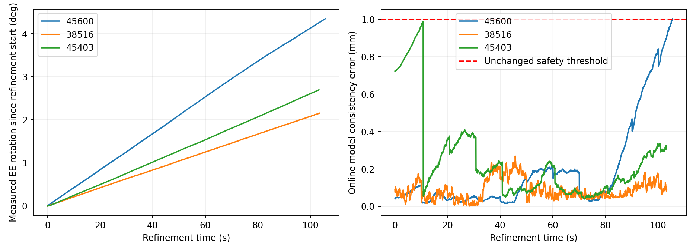
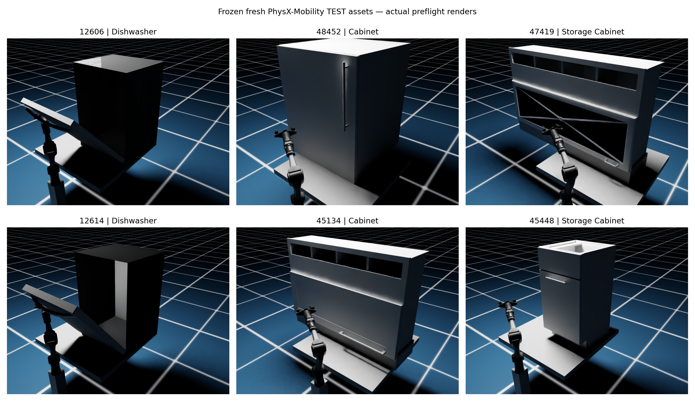

## Diagnostic DEV: actual bounded refinement (outside TEST denominator)

| Asset | Discovery | Segments | Extra EE rotation | Door opening, post-eval | Stop | Min margin |
|---|---|---:|---:|---:|---|---:|
| 45600 | PROVISIONAL_REVOLUTE | 52 | 4.347° | 5.106° | SUSTAINED_RELATIVE_SLIP (J5) | 0.15278 |
| 38516 | PROVISIONAL_REVOLUTE | 51 | 2.153° | 2.726° | LOW_JOINT_MARGIN (J5) | 0.05000 |
| 45403 | PROVISIONAL_REVOLUTE | 51 | 2.696° | 3.601° | LOW_JOINT_MARGIN (J5) | 0.04999 |

All three reached active refinement and repeated robust joint fitting. None reached the independent final validation/acceptance stage before a frozen safety stop. Door motion >=5° alone is not an accepted reconstruction or end-to-end success.

## Regression controls

- 7320: SUCCESS; actual opening 5.621°, true final relative slip 0.145 mm.
- 45621: SUCCESS; actual opening 5.585°, true final relative slip 0.501 mm.

## Fresh TEST: provisional to refinement evidence

| Episode | Steps | Door motion (post-eval) | First stop | Model error | Contact-plane drift | Final true relative slip | Final accepted |
|---|---:|---:|---|---:|---:|---:|---|
| test_45134_00 | 28 | 2.529° | SUSTAINED_RELATIVE_SLIP | 1.005 mm | 0.106 mm | 0.814 mm | False |
| test_45134_01 | 8 | 1.581° | SUSTAINED_RELATIVE_SLIP | 1.003 mm | 0.018 mm | 1.004 mm | False |

### Post-stop GT diagnostics (latest online estimate is not final T2)

| Episode | Discovery axis error | Latest online axis error | Discovery axis-line error | Latest online axis-line error |
|---|---:|---:|---:|---:|
| test_45134_00 | 0.136° | 0.200° | 53.769 mm | 59.711 mm |
| test_45134_01 | 9.159° | 9.159° | 82.600 mm | 82.600 mm |

`online_refinement_diagnostics.csv` separately records discovery versus latest online axis/axis-line error. The latest online fit is not an accepted T2 when independent validation was not completed.

## Asset and run integrity

- All frozen code/config hashes still match; method and asset/config manifests precede TEST execution. No TEST-dependent tuning or replacement.
- `deployment_diagnostics.csv` includes post-stop passive startup motion and every mobile-search result. Passive door opening is not credited to robot interaction.
- Dataset visual geometry is retained. Contact uses the existing approximate interaction proxies; this is not a hardware fidelity claim.

## Prediction evidence

If no final model is accepted, held-out structural prediction is **NOT REACHED**. No training residual is substituted for held-out RMSE; no T2 superiority is claimed.

## Videos

- `dev/45600/contact_baseline.mp4`: continuous approach, real closure, provisional discovery and refinement ending at the model-consistency safety stop.
- `controls/7320/contact_baseline.mp4`: successful original regression; explicitly not an unseen TEST success.
- Preflight-only failures have actual render images, not fabricated execution videos.

## Interpretation

The premature discovery gate was removed without relaxing final acceptance. DEV failure has moved to J5 margin and the frozen model-consistency supervisor. Fresh TEST deployment coverage must be read independently: episodes that cannot reach a grasp say nothing about whether their articulation fitter would succeed. Do not tune the fitter further based on these outcomes.
